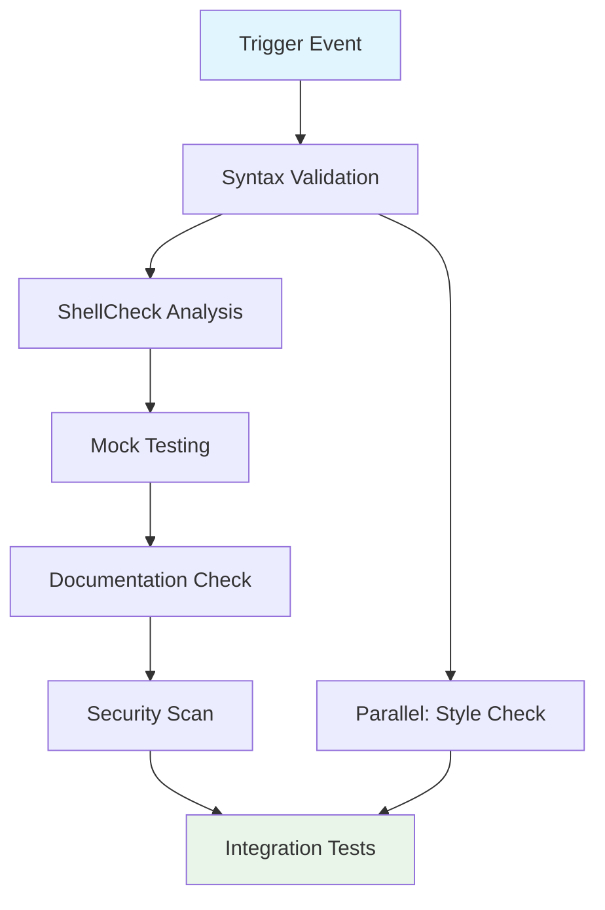

## Workflow Overview

**Purpose**: Validate shell script syntax, test network detection logic, and ensure macOS compatibility for the wireless auto-switch utility
**Trigger Events**: Push to main/master branch, pull requests, manual dispatch
**Target Environments**: macOS runners (latest, Ventura, Sonoma, Sequoia)

## Execution Flow Diagram



## Jobs & Dependencies

| Job Name | Purpose | Dependencies | Execution Context |
|----------|---------|--------------|-------------------|
| syntax-validation | Validate shell script syntax | None | Ubuntu-latest |
| shellcheck-analysis | Static analysis for shell scripts | syntax-validation | Ubuntu-latest |
| mock-testing | Test network detection with mocked interfaces | shellcheck-analysis | macOS-latest |
| documentation-check | Validate README and documentation | None | Ubuntu-latest |
| security-scan | Check for security vulnerabilities | syntax-validation | Ubuntu-latest |
| integration-test | End-to-end testing on macOS | mock-testing | macOS-12, macOS-13, macOS-14 |

## Requirements Matrix

### Functional Requirements
| ID | Requirement | Priority | Acceptance Criteria |
|----|-------------|----------|-------------------|
| REQ-001 | Shell script syntax validation | High | All .sh files pass bash syntax check |
| REQ-002 | Network detection logic verification | High | Mock tests verify interface detection patterns |
| REQ-003 | macOS compatibility testing | High | Scripts execute successfully on supported macOS versions |
| REQ-004 | LaunchDaemon configuration validation | Medium | plist files validate against macOS schema |

### Security Requirements
| ID | Requirement | Implementation Constraint |
|----|-------------|---------------------------|
| SEC-001 | No hardcoded credentials or secrets | Static analysis must detect and fail on secrets |
| SEC-002 | Privilege escalation validation | Verify sudo usage follows security best practices |
| SEC-003 | File permission verification | Ensure installation scripts set appropriate permissions |

### Performance Requirements
| ID | Metric | Target | Measurement Method |
|----|-------|--------|-------------------|
| PERF-001 | Workflow execution time | < 10 minutes | GitHub Actions timing |
| PERF-002 | Script execution time | < 5 seconds | Time command measurement |
| PERF-003 | Network detection latency | < 2 seconds | Mock interface testing |

## Input/Output Contracts

### Inputs

```yaml
# Environment Variables
RUNNER_OS: string  # Purpose: Operating system detection
GITHUB_TOKEN: secret  # Purpose: Repository access for workflow operations

# Repository Triggers
paths: 
  - "*.sh"
  - "*.plist"
  - "README.md"
  - ".github/workflows/*"
branches: 
  - "main"
  - "master"
  - "develop"
```

### Outputs

```yaml
# Job Outputs
shellcheck_results: file  # Description: Static analysis report
test_coverage: string  # Description: Test coverage percentage
security_scan_results: file  # Description: Security vulnerability report
compatibility_matrix: file  # Description: macOS version compatibility results
```

### Secrets & Variables

| Type | Name | Purpose | Scope |
|------|------|---------|-------|
| Secret | GITHUB_TOKEN | Repository access | Workflow |
| Variable | SUPPORTED_MACOS_VERSIONS | Target OS versions | Repository |

## Execution Constraints

### Runtime Constraints

- **Timeout**: 15 minutes maximum per workflow
- **Concurrency**: Allow parallel execution for different branches
- **Resource Limits**: Standard GitHub Actions runner limits

### Environmental Constraints

- **Runner Requirements**: macOS-12, macOS-13, macOS-14 for integration tests
- **Network Access**: Required for package installation and updates
- **Permissions**: Standard repository permissions, no elevated access needed

## Error Handling Strategy

| Error Type | Response | Recovery Action |
|------------|----------|-----------------|
| Syntax Failure | Fail fast, stop workflow | Display specific syntax errors with line numbers |
| ShellCheck Warning | Continue with annotations | Log warnings but allow progression |
| Mock Test Failure | Fail workflow | Provide detailed test output and expected vs actual |
| Documentation Error | Continue with warning | Annotate PR with documentation issues |
| Security Vulnerability | Fail workflow | Block merge until vulnerabilities addressed |

## Quality Gates

### Gate Definitions

| Gate | Criteria | Bypass Conditions |
|------|----------|-------------------|
| Syntax Validation | All shell scripts pass bash -n check | Never - fundamental requirement |
| ShellCheck Analysis | No critical or error-level issues | Warnings allowed with annotation |
| Security Scan | No high/critical vulnerabilities | None - security is non-negotiable |
| Mock Testing | All test scenarios pass | Never - functionality validation required |

## Monitoring & Observability

### Key Metrics

- **Success Rate**: Target 95% workflow success rate
- **Execution Time**: Target sub-10 minute execution
- **Test Coverage**: Monitor mock test scenario coverage

### Alerting

| Condition | Severity | Notification Target |
|-----------|----------|-------------------|
| Workflow failure rate > 20% | High | Repository maintainers |
| Security vulnerabilities detected | Critical | Security team and maintainers |
| macOS compatibility regression | Medium | Development team |

## Integration Points

### External Systems

| System | Integration Type | Data Exchange | SLA Requirements |
|--------|------------------|---------------|------------------|
| ShellCheck | Static analysis tool | Script files input, report output | Best effort |
| GitHub Security | Vulnerability scanning | Repository metadata | GitHub SLA |
| macOS System APIs | Mock testing | Network interface simulation | N/A (mocked) |

### Dependent Workflows

| Workflow | Relationship | Trigger Mechanism |
|----------|--------------|-------------------|
| Release Workflow | Downstream | Triggered on successful validation |
| Documentation Update | Parallel | Triggered on same events |

## Compliance & Governance

### Audit Requirements

- **Execution Logs**: Retain for 90 days minimum
- **Approval Gates**: Required reviews for workflow modifications
- **Change Control**: All workflow changes require PR review

### Security Controls

- **Access Control**: Repository write access required for workflow modifications
- **Secret Management**: GitHub Secrets with rotation every 90 days
- **Vulnerability Scanning**: Integrated with GitHub Security Advisory Database

## Edge Cases & Exceptions

### Scenario Matrix

| Scenario | Expected Behavior | Validation Method |
|----------|-------------------|-------------------|
| Non-macOS runner for integration tests | Skip with clear message | Runner OS detection |
| Missing network interfaces | Graceful degradation | Mock interface availability check |
| Unsupported macOS version | Fail with version requirements | OS version validation |
| Corrupted plist files | Fail with XML validation error | plist syntax validation |
| Missing dependencies | Auto-install or fail with clear error | Dependency check before execution |

## Validation Criteria

### Workflow Validation

- **VLD-001**: All shell scripts execute without syntax errors
- **VLD-002**: Network detection logic handles various interface configurations
- **VLD-003**: LaunchDaemon configuration validates against macOS standards
- **VLD-004**: Installation scripts properly handle permission requirements
- **VLD-005**: Error conditions provide actionable feedback

### Performance Benchmarks

- **PERF-001**: Workflow completes within 10-minute target 95% of the time
- **PERF-002**: Script execution time remains under 5-second threshold
- **PERF-003**: Network detection responds within 2-second limit in test scenarios

## Change Management

### Update Process

1. **Specification Update**: Modify this document first with rationale
2. **Review & Approval**: Technical review by 2+ maintainers
3. **Implementation**: Apply changes to workflow files
4. **Testing**: Validate on non-production branch first
5. **Deployment**: Merge to main after successful validation

### Version History

| Version | Date | Changes | Author |
|---------|------|---------|--------|
| 1.0 | 2025-09-14 | Initial specification for macOS utility validation | GitHub Copilot |

## Related Specifications

- [Shell Script Standards](../coding-standards/shell-script-guidelines.md)
- [macOS System Integration Requirements](../architecture/macos-system-integration.md)
- [Security Requirements for System Utilities](../security/system-utility-security.md)